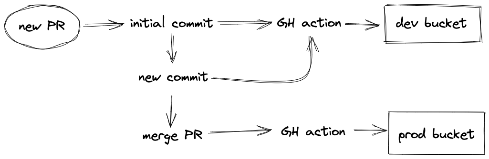

## Bosmans & Beyond v2

This is a WIP project aiming to replace the [existing website](https://github.com/BKmetoff/bosmans-and-beyond), currently hosted on Netlify.

The project is a static HTML/CSS page, using vanilla JavaScript to dynamically populate the DOM.

### Hosting

It is and will remain hosted on AWS s3, utilizing s3's static website hosting capabilities.

### Deployment

Using GH Actions, the content of this repo is pushed to two s3 buckets:

- opening new PRs on `master` pushes to a dev bucket on each new commit;
- once PRs on `master` are merged and closed, the content is pushed to a production bucket;

